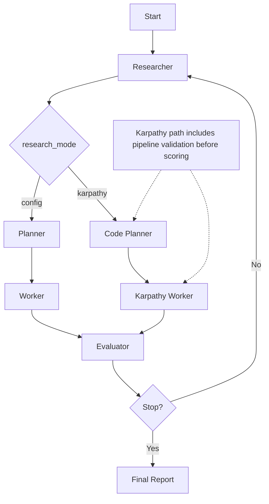

<div align="center">
  
</div>

# AutoRAG Research Lab

An automated research and experimentation platform for enterprise Retrieval-Augmented Generation (RAG) systems. Built as a hackathon showcase project, this platform enables developers and researchers to systematically benchmark, evaluate, and optimize RAG pipelines through autonomous agent-driven experimentation.

## Motivation

Modern RAG systems have many interacting degrees of freedom: retrieval strategy, embedding model, chunk size, reranking, query rewriting, source diversity, and more. Tuning these by hand is slow and rarely exhaustive. This project applies the same idea behind [karpathy/autoresearch](https://github.com/karpathy/autoresearch) — autonomous agents that iteratively modify and evaluate a system overnight — but targets enterprise RAG rather than LLM training. Instead of editing `train.py` and measuring validation bits-per-byte, agents here edit the retrieval pipeline and measure retrieval accuracy against a fixed benchmark corpus.

The core loop is:

1. A **Planner** agent formulates a retrieval hypothesis.
2. A **Code Planner** agent rewrites the pipeline code and configuration.
3. A **Worker** agent executes the benchmark, either in-process or inside a Docker sandbox.
4. An **Evaluator** agent scores the result, decides whether to accept or reject the change, and feeds the outcome back into the next iteration.

You let the system run overnight and inspect a ranked log of experiments in the morning.

## Models Used in This Project

### Google Frontier Models by Agent

The autonomous agents in this project use Google Gemini frontier models, with environment-configurable defaults:

- `GEMINI_MODEL` (default: `gemini-3.1-pro`)
- `GEMINI_FAST_MODEL` (default: `gemini-2.5-flash`)

Agent-level usage:

- **Researcher agent** (`src/agents/researcher.py`): uses `GEMINI_MODEL` first, then falls back across `gemini-3.1-pro` and `gemini-2.5-flash`.
- **Planner agent** (`src/agents/planner.py`): prioritizes `GEMINI_FAST_MODEL`, then `GEMINI_MODEL`, then `gemini-2.5-flash`.
- **Code Planner agent** (`src/agents/code_planner.py`): prioritizes `GEMINI_FAST_MODEL`, then `GEMINI_MODEL`, with fallbacks `gemini-2.5-flash` and `gemini-3.1-pro`.
- **Evaluator agent** (`src/agents/evaluator.py`): uses `GEMINI_FAST_MODEL` for final research-session synthesis/reporting.
- **Benchmark answer generation path** (`src/benchmark/runner.py`): tries `GEMINI_FAST_MODEL`, `GEMINI_MODEL`, then `gemini-2.5-flash` and `gemini-3.1-pro`.

### Transformer Embedding Models Used

- **Primary embedding model**: `BAAI/bge-base-en-v1.5` (configured via `EMBEDDING_MODEL`).
- **Embedding framework**: `sentence-transformers` (`SentenceTransformer`) for dense vector encoding used by Qdrant retrieval.

## Dataset

Benchmarking is performed against the [EnterpriseRAG-Bench](https://github.com/onyx-dot-app/EnterpriseRAG-Bench) dataset, a publicly available corpus of over 500,000 synthetic company-internal documents (Slack, Gmail, Linear, Confluence, GitHub PRs, and more) paired with 500 questions across ten difficulty categories ranging from simple factual lookup to multi-document reasoning and conflicting-information resolution.

For reproducibility, several slices of the dataset have been uploaded to [Hugging Face](https://huggingface.co/MonotonicLabs/datasets) so that benchmark runs do not depend on the original archive download. The export and restore scripts (`export_streamable_hf_dataset.py`, `restore_streamable_hf_dataset.py`) handle serialization and reconstruction of the Qdrant vector index from these slices.

## Features

- **Autonomous AI agents**: Orchestrates specialized agents (Planner, Code Planner, Worker, Researcher, Evaluator) to automatically formulate hypotheses, implement retrieval pipelines, and evaluate their performance without human intervention.
- **Comprehensive benchmarking**: Built-in support for the EnterpriseRAG-Bench question set, measuring retrieval accuracy across question types. A sandboxed Karpathy-mode runner isolates each candidate pipeline in a Docker container with controlled CPU, memory, and thread budgets for fair comparison.
- **Pluggable retrieval strategies**: Dense (vector), sparse (BM25), and hybrid retrieval are all first-class strategies. The agent can tune BM25/dense fusion weights, enable cross-encoder reranking, and apply query rewriting per iteration.
- **Semantic no-op detection**: Before submitting a candidate, the system checks via AST comparison whether the proposed code is semantically equivalent to the current pipeline. Comment-only or docstring-only edits are rejected and replaced with a meaningful fallback.
- **Config exploration enforcement**: Each iteration must produce both a code change and a distinct configuration. Fingerprint-based deduplication prevents the agent from revisiting configurations that have already been tried.
- **Interactive dashboard**: Real-time web interface to monitor ongoing experiments, compare results on a leaderboard, and inspect the history of accepted and rejected iterations with per-type performance breakdowns.
- **Static code validation**: Candidate pipelines are validated for syntax, forbidden module imports (`os`, `subprocess`, `socket`, etc.), and correct `retrieve(question, retriever, top_k)` signature before execution.

## Architecture

### Agent Flow Diagram



```
src/
  agents/
    planner.py          — Hypothesis generation
    code_planner.py     — Pipeline code + config synthesis, validation, fallback logic
    karpathy_worker.py  — Docker sandbox execution and in-process fallback
    karpathy_validation.py — AST-based static validation for candidate pipelines
    worker.py           — Experiment orchestration
    researcher.py       — Literature-style context retrieval to inform hypotheses
    evaluator.py        — Scoring, acceptance decisions, and session reporting
    progress.py         — Context-var-based progress reporting
    graph.py            — LangGraph state machine wiring all agents together
    state.py            — Shared ResearchLabState definition
  benchmark/
    loader.py           — EnterpriseRAG-Bench question loading
    runner.py           — Benchmark execution and metric aggregation
    karpathy_sandbox.py — Sandboxed benchmark runner interface
    metrics.py          — Composite score computation
  retrieval/
    base.py             — BaseRetriever and RetrievedDocument interfaces
    dense.py            — In-memory dense retrieval
    qdrant_dense.py     — Qdrant-backed dense retrieval
    hybrid.py           — BM25 + dense fusion
    reranker.py         — Cross-encoder reranking
    embeddings.py       — Embedding model management
    pipeline.py         — Active pipeline slot (swapped per iteration)
  api/
    main.py             — FastAPI application entry point
    routes.py           — REST endpoints for agent control and experiment data
  dashboard/
    app.py              — Flask dashboard application
  db.py                 — Async SQLite persistence
  config.py             — Settings (environment-driven via Pydantic)
  models.py             — Shared Pydantic data models
```

## Tech Stack

### Core AI and Backend

- **Python 3.11+**: Runtime for all agent and retrieval code.
- **LangChain and LangGraph**: Agent orchestration, state machine management, and LLM provider integrations (Google Generative AI).
- **FastAPI and Uvicorn**: Asynchronous REST API for agent control and result streaming.
- **Qdrant**: High-performance vector database for dense retrieval.
- **Sentence Transformers**: Text embedding generation for semantic search.
- **rank-bm25**: Sparse retrieval via BM25.
- **SQLite (aiosqlite)**: Lightweight asynchronous persistence for experiment results and state.
- **Docker**: Sandboxed execution of candidate pipelines with configurable CPU, memory, and thread limits.

### Frontend

- **Flask and Werkzeug**: Interactive web dashboard with session management.
- **Jinja2**: Server-side HTML templating (`src/templates`).
- **Bulma CSS**: Responsive, low-boilerplate CSS framework.
- **Chart.js**: Real-time charts for experiment metrics and leaderboard visualization.

## Quick Start

```bash
# 1. Copy environment configuration
cp .env.example .env
# Edit .env to add your API keys and dataset paths

# 2. Build and start all services
docker compose up --build

# 3. Open the dashboard
open http://localhost:5001
```

The API is available at `http://localhost:8001`. Start a research run by posting a hypothesis to `/api/v1/run/karpathy` and monitor progress through the dashboard.

## Sandboxed Execution

When `KARPATHY_SANDBOX_ENABLED=true`, each candidate pipeline is executed inside a fresh Docker container with:

- Configurable CPU quota (`KARPATHY_SANDBOX_CPUS`)
- Memory limit (`KARPATHY_SANDBOX_MEMORY`, default `3g`)
- Thread count pinning for all major linear algebra libraries (`OMP_NUM_THREADS`, `MKL_NUM_THREADS`, etc.)
- Network disabled in offline mode

This ensures that experiments are isolated, reproducible, and cannot interfere with the host process. When Docker is unavailable, the system falls back to in-process execution automatically.

## Acknowledgements

- [karpathy/autoresearch](https://github.com/karpathy/autoresearch): the original inspiration for applying autonomous agent loops to systematic empirical research, with nightly experiment cycles and a fixed evaluation budget.
- [onyx-dot-app/EnterpriseRAG-Bench](https://github.com/onyx-dot-app/EnterpriseRAG-Bench): the benchmark dataset and evaluation methodology used for all retrieval experiments in this project.

## Contributors

<div align="center">
  <a href="https://github.com/fran-gen">
    
  </a>
  <a href="https://github.com/Bonhollow">
    
  </a>
  <a href="https://github.com/DeanHnter">
    
  </a>
</div>
